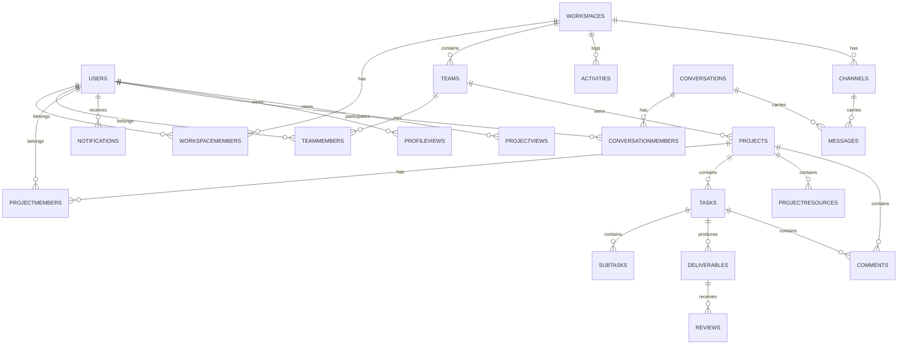

# Nexus Database Foundation

This document describes the Nexus data layer, which is implemented with **MongoDB through Mongoose** (the database technology already configured in this project). The schema mirrors the planned relational architecture of Nexus: workspaces, teams, projects, tasks, deliverables, reviews, comments, notifications, activity, channels, and direct messages.

> Note: The original phase brief was written against PostgreSQL. Following the project's existing setup, this foundation is expressed with **MongoDB + Mongoose** using the same conceptual hierarchy, relationships, enums, and constraints. See [Assumptions](#assumptions) at the end.

---

## 1. Purpose

Nexus is a real-time collaborative project and research management platform. The data layer stores:

- Workspaces, teams, and their memberships
- Projects, project members, tasks, subtasks, deliverables and reviews
- Project resources
- Comments (on projects or tasks)
- Notifications
- Activity logs
- Channels and messages (workspace + direct)
- Profile and project view history (powering "Recently Viewed" widgets)

---

## 2. Entity Hierarchy

```text
Workspace
   │
   ├── Teams
   │     │
   │     └── Members (TeamMember)
   │
   └── Projects
          │
          ├── Members (ProjectMember)
          ├── Tasks
          │     └── Subtasks (embedded)
          │
          ├── Deliverables
          │     └── Reviews
          │
          ├── Resources (ProjectResource)
          ├── Comments
          └── Activity
```

Channels live on the workspace (workspace-wide) or on a project. Direct messages use conversations.

---

## 3. Relationships (Mermaid)



---

## 4. Collection / Table Reference

Every model uses:

- `_id` — MongoDB ObjectId (primary key)
- `createdAt` / `updatedAt` — timestamps (`timestamps: true`)
- camelCase field names, matching the existing Nexus codebase

### users

| Field      | Type   | Notes                                   |
|------------|--------|-----------------------------------------|
| `_id`      | ObjectId | Primary key                           |
| `name`     | String | Required, trimmed, ≤100 chars           |
| `email`    | String | **Unique**, lowercased, trimmed, indexed |
| `password` | String | bcrypt hash, never plaintext, `select:false` |
| `avatar`   | String | Nullable/empty                          |
| `role`     | String | Enum `OWNER / ADMIN / PROJECT_MANAGER / MEMBER / VIEWER / COLLABORATOR`, default `MEMBER` |

### workspaces

| Field         | Type     | Notes                       |
|---------------|----------|-----------------------------|
| `name`        | String   | Required, trimmed, ≤120     |
| `description` | String   | Default `""`, ≤1000         |
| `ownerId`     | ObjectId | FK → users, required, indexed |
| `channels`    | [channel] | Embedded workspace channels |

### workspacemembers

Workspace-level membership (kept from the existing app). Distinct from team and project membership.

| Field         | Type     | Notes                                      |
|---------------|----------|--------------------------------------------|
| `workspaceId` | ObjectId | FK → workspaces, indexed                   |
| `userId`      | ObjectId | FK → users                                 |
| `role`        | String   | Enum `Admin / Member / Viewer`, default `Member` |
| —             | —        | **Unique index `(workspaceId, userId)`**   |

### teams

| Field         | Type     | Notes                     |
|---------------|----------|---------------------------|
| `workspaceId` | ObjectId | FK → workspaces, indexed  |
| `name`        | String   | Required, trimmed, ≤120   |
| `description` | String   | Default `""`, ≤1000       |
| —             | —        | **Unique index `(workspaceId, name)`** |

### teammembers

| Field      | Type     | Notes                                |
|------------|----------|--------------------------------------|
| `teamId`   | ObjectId | FK → teams, indexed                  |
| `userId`   | ObjectId | FK → users                           |
| `role`     | String   | Enum `TEAM_LEAD / MEMBER`, default `MEMBER` |
| `joinedAt` | Date     | Default now                          |
| —          | —        | **Unique index `(teamId, userId)`**, `userId` indexed |

### projects

| Field         | Type     | Notes                                      |
|---------------|----------|--------------------------------------------|
| `workspaceId` | ObjectId | FK → workspaces, required, indexed         |
| `teamId`      | ObjectId | FK → teams, nullable, indexed              |
| `name`        | String   | Required, trimmed, ≤140                    |
| `description` | String   | Default `""`, ≤2000                        |
| `status`      | String   | Enum `PLANNING / ACTIVE / ON_HOLD / COMPLETED / ARCHIVED`, default `PLANNING`, indexed |
| `priority`    | String   | Enum `LOW / MEDIUM / HIGH / URGENT`, default `MEDIUM` |
| `managerId`   | ObjectId | FK → users (Project Manager), nullable, indexed |
| `startDate`   | Date     | Nullable                                 |
| `dueDate`     | Date     | Nullable                                 |
| `createdBy`   | ObjectId | FK → users, required                     |
| —             | —        | Compound index `(workspaceId, status)`   |

### projectmembers

Project membership **controls access to a private project**. A workspace/team/workspace membership does granting access. Since Phase 9, an invited user must also belong to the project's **workspace** (a `workspacemembers` row or the workspace owner); team membership is **not** required, so cross-team collaborators are allowed.

| Field      | Type     | Notes                                          |
|------------|----------|------------------------------------------------|
| `projectId`| ObjectId | FK → projects, indexed                         |
| `userId`   | ObjectId | FK → users                                     |
| `role`     | String   | Enum `PROJECT_MANAGER / MEMBER / VIEWER / COLLABORATOR`, default `MEMBER` |
| `joinedAt` | Date     | Default now                                    |
| —          | —        | **Unique index `(projectId, userId)`**, `userId` indexed |

### boardcolumns

Existing board support: a column belongs to a `project` and orders tasks horizontally.

### tasks

| Field        | Type       | Notes                                  |
|--------------|------------|----------------------------------------|
| `projectId`  | ObjectId   | FK → projects, required, indexed       |
| `columnId`   | ObjectId   | FK → boardcolumns, required, indexed   |
| `title`      | String     | Required, trimmed, ≤300                |
| `description`| String     | Default `""`, ≤10000                   |
| `assignedTo` | ObjectId   | FK → users, nullable (unassigned)      |
| `status`     | String     | Enum — see [Task statuses](#task-statuses), default `TO DO` |
| `priority`   | String     | Enum — see [Priorities](#priorities), default `Medium` |
| `position`   | Number     | Board ordering, default 0              |
| `dueDate`    | Date       | Nullable                               |
| `tags`       | [String]   | Default `[]`                           |
| `subtasks`   | [subtask]  | Embedded subtask documents             |
| `createdBy`  | ObjectId   | FK → users, required                   |
| —            | —          | Index `(projectId, columnId, position)` |

#### Subtasks (embedded)

| Field      | Type    | Notes                                  |
|------------|---------|----------------------------------------|
| `title`    | String  | Required, ≤300                         |
| `completed`| Boolean | Default `false`                        |
| `weight`   | Number  | Per-subtask percentage contribution, `0–100`, default `0`. Sum-to-100 is enforced in the service layer (documented in [Assumptions](#assumptions)). |

### deliverables

| Field          | Type     | Notes                                |
|----------------|----------|--------------------------------------|
| `taskId`       | ObjectId | FK → tasks, required, indexed        |
| `submittedBy`  | ObjectId | FK → users, required, indexed        |
| `title`        | String   | Required, ≤200                       |
| `description`  | String   | Default `""`, ≤5000                  |
| `fileUrl`      | String   | Default `""`, ≤1000                  |
| `version`      | Number   | Default `1`, min `1` (v1, v2, v3…)   |
| `status`       | String   | Enum `DRAFT / SUBMITTED / UNDER_REVIEW / CHANGES_REQUESTED / APPROVED`, default `DRAFT` |
| `submittedAt`  | Date     | Nullable                             |
| —              | —        | Index `(taskId, version)`            |

### reviews

| Field           | Type     | Notes                                    |
|-----------------|----------|------------------------------------------|
| `deliverableId` | ObjectId | FK → deliverables, required, indexed     |
| `reviewerId`    | ObjectId | FK → users, required, indexed            |
| `decision`      | String   | Enum `APPROVED / CHANGES_REQUESTED`, required |
| `feedback`      | String   | Default `""`, ≤5000                      |
| `reviewedAt`    | Date     | Default now                              |
| —               | —        | Index `(deliverableId, reviewedAt)`      |

### projectresources

| Field        | Type     | Notes                                            |
|--------------|----------|--------------------------------------------------|
| `projectId`  | ObjectId | FK → projects, required, indexed                 |
| `name`       | String   | Required, ≤200                                   |
| `url`        | String   | Default `""`, ≤1000                              |
| `category`   | String   | Enum `RESEARCH / AI / DEVELOPMENT / DESIGN / DOCUMENTATION / REFERENCE / OTHER`, default `OTHER` |
| `description`| String   | Default `""`, ≤2000                              |
| `createdBy`  | ObjectId | FK → users, required                             |
| —            | —        | Index `(projectId, category)`                    |

### comments

A comment belongs to **either** a project or a task (never neither — enforced in a pre-validate hook).

| Field       | Type     | Notes                            |
|-------------|----------|----------------------------------|
| `projectId` | ObjectId | FK → projects, nullable, indexed |
| `taskId`    | ObjectId | FK → tasks, nullable, indexed    |
| `userId`    | ObjectId | FK → users, required             |
| `content`   | String   | Required, ≤5000                  |

Indexes: `(taskId, createdAt)`, `(projectId, createdAt)`, `userId`.

### notifications

| Field        | Type     | Notes                               |
|--------------|----------|-------------------------------------|
| `userId`     | ObjectId | FK → users, required, indexed       |
| `actorId`    | ObjectId | FK → users, nullable                |
| `workspaceId`| ObjectId | FK → workspaces, nullable           |
| `type`       | String   | Enum — see [Notification types](#notification-types) |
| `title`      | String   | Required, ≤300                      |
| `body`       | String   | Default `""`, ≤2000                 |
| `link`       | String   | Default `""`                        |
| `read`       | Boolean  | Default `false`, indexed            |
| `entityType` | String   | Enum `project/task/subtask/deliverable/review/comment/member/channel/workspace/team`, nullable |
| `entityId`   | ObjectId | Related entity, nullable, indexed   |

### activities

| Field         | Type     | Notes                                    |
|---------------|----------|------------------------------------------|
| `workspaceId` | ObjectId | FK → workspaces, required, indexed       |
| `projectId`   | ObjectId | FK → projects, nullable, indexed         |
| `userId`      | ObjectId | FK → users, required                     |
| `action`      | String   | Enum — see [Activity actions](#activity-actions) |
| `targetType`  | String   | Enum `task/project/document/member/channel/workspace/comment/subtask/deliverable/review/resource/team` |
| `targetId`    | ObjectId | Related entity                          |
| `metadata`    | Mixed    | JSONB-equivalent free-form context (e.g. `{ taskTitle, previousStatus, newStatus }`) |

### channels

Channels are **embedded on `workspaces.channels`** (each has `name`, optional `description`, optional `projectId`, `createdBy`). A channel can be workspace-wide (`projectId: null`) or project-specific.

### messages

| Field           | Type     | Notes                                 |
|-----------------|----------|---------------------------------------|
| `workspaceId`   | ObjectId | FK → workspaces, required, indexed    |
| `channelId`     | String   | Workspace channel id, nullable, indexed |
| `conversationId`| ObjectId | FK → conversations, nullable, indexed |
| `userId`        | ObjectId | FK → users (sender), required         |
| `content`       | String   | Required, ≤5000                       |

### conversations

| Field      | Type     | Notes                       |
|------------|----------|-----------------------------|
| `name`     | String   | Optional, ≤200              |
| `isGroup`  | Boolean  | `false` = direct message    |
| `createdBy`| ObjectId | FK → users, nullable        |

### conversationmembers

| Field            | Type     | Notes                                  |
|------------------|----------|----------------------------------------|
| `conversationId` | ObjectId | FK → conversations, indexed            |
| `userId`         | ObjectId | FK → users                             |
| —                | —        | **Unique index `(conversationId, userId)`**, `userId` indexed |

### profileviews

Tracks when an authenticated user views another member's profile (powers "Recently Viewed Members").

| Field           | Type     | Notes                                          |
|-----------------|----------|------------------------------------------------|
| `viewerId`      | ObjectId | FK → users, indexed                           |
| `viewedUserId`  | ObjectId | FK → users, indexed                           |
| `lastViewedAt`  | Date     | Updated on each view                          |
| —               | —        | **Unique index `(viewerId, viewedUserId)`**, index `(viewerId, lastViewedAt)` |

### projectviews

Tracks projects viewed by the current user (powers "Recently Viewed Projects").

| Field          | Type     | Notes                                     |
|----------------|----------|-------------------------------------------|
| `viewerId`     | ObjectId | FK → users, indexed                       |
| `projectId`    | ObjectId | FK → projects, indexed                    |
| `lastViewedAt` | Date     | Updated on each view (no new row on refresh) |
| —              | —        | **Unique index `(viewerId, projectId)`**, index `(viewerId, lastViewedAt)` |

---

## 5. Enums

### User roles

`OWNER`, `ADMIN`, `PROJECT_MANAGER`, `MEMBER`, `VIEWER`, `COLLABORATOR`

### Task statuses

The board model (existing app) uses `TO DO`, `IN PROGRESS`, `REVIEW`, `DONE`. The phase spec statuses were added to the same enum:

`TO DO`, `IN PROGRESS`, `REVIEW`, `DONE`, `ASSIGNED`, `SUBMITTED`, `UNDER_REVIEW`, `CHANGES_REQUESTED`, `APPROVED`, `BLOCKED`

### Priorities

Both casings accepted for compatibility with the existing board (`Low`, `Medium`, `High`, `Urgent`) and the new spec (`LOW`, `MEDIUM`, `HIGH`, `URGENT`).

### Project statuses

`PLANNING`, `ACTIVE`, `ON_HOLD`, `COMPLETED`, `ARCHIVED`

### Deliverable statuses

`DRAFT`, `SUBMITTED`, `UNDER_REVIEW`, `CHANGES_REQUESTED`, `APPROVED`

### Review decisions

`APPROVED`, `CHANGES_REQUESTED`

### Project resource categories

`RESEARCH`, `AI`, `DEVELOPMENT`, `DESIGN`, `DOCUMENTATION`, `REFERENCE`, `OTHER`

### Team roles (separate from workspace roles)

`TEAM_LEAD`, `MEMBER`

### Notification types

`TASK_ASSIGNED`, `TASK_COMPLETED`, `DELIVERABLE_SUBMITTED`, `DELIVERABLE_REVIEWED`, `PROJECT_INVITATION`, `COMMENT_MENTION`, plus existing `MENTION`, `TASK_MOVED`, `MEMBER_ADDED`, `DOCUMENT_SHARED`

### Activity actions

`TASK_CREATED`, `TASK_STARTED`, `TASK_MOVED`, `TASK_UPDATED`, `TASK_COMPLETED`, `TASK_DELETED`, `SUBTASK_COMPLETED`, `DELIVERABLE_SUBMITTED`, `DELIVERABLE_APPROVED`, `PROJECT_CREATED`, `PROJECT_UPDATED`, `MEMBER_INVITED`, `DOCUMENT_CREATED`, `DOCUMENT_UPDATED`, `RESOURCE_ADDED`, `MEMBERSHIP_UPDATED`, `COMMENT_ADDED`, `CHANNEL_JOINED`, `TEAM_CREATED`, `TEAM_UPDATED`, `TEAM_DELETED`, `TEAM_MEMBER_ADDED`, `TEAM_MEMBER_REMOVED`

Activity tracking covers meaningful in-app actions only — **never** keyboard/mouse/screen/browser activity.

---

## 6. Project Access Model

- **Workspace membership** (`workspacemembers`) — who is in the workspace and their workspace-level role.
- **Team membership** (`teammembers`) — who is in which team (`TEAM_LEAD` / `MEMBER`).
- **Project membership** (`projectmembers`) — **the source of truth for who can access a project**.

Being a workspace or team member does **not** grant access to a private project. A user must have a `projectmembers` row for that project. Channel access likewise does not imply project access.

---

## 7. Delete Behavior

MongoDB has no `ON DELETE` triggers. Deletion behavior is handled in the application layer. The established intent:

| Entity deleted            | Related data                            |
|---------------------------|------------------------------------------|
| Workspace                 | Memberships, projects, tasks, activities deleted (existing controller behavior) |
| Team                      | Its `teammembers` rows removed; `projects.teamId` set to `null` (**projects are preserved** and remain the team's orphaned projects) |
| Project                   | Its tasks, subtasks, deliverables, reviews, resources removed |
| User                      | **Activity logs and messages are preserved** (historical records), memberships removed |

---

## 8. How to Run Migrations (Index Build)

Models define their own schema and indexes. Building/verifying indexes on a running database:

```bash
# from backend/
npm run db:indexes
```

This calls `src/database/syncIndexes.js`, connects using `MONGO_URI`, and ensures every index defined in the models exists.

`Mongoose` also auto-creates indexes in development when the server boots.

---

## 9. How to Seed Development Data

```bash
# from backend/
npm run db:seed
```

`src/database/seed.js` drops the Nexus collections, rebuilds indexes, and inserts:

- 1 workspace, 7 users (bcrypt-hashed `Password123!`), 7 workspace memberships
- 4 teams, 10 team memberships
- 7 projects, 13 project memberships
- 5 project resources, 12 board columns, 4 tasks (with weighted subtasks)
- 1 deliverable, 1 review, 3 comments
- 3 notifications, 4 activity logs
- 1 conversation, 2 members, 3 messages
- 3 profile views, 3 project views

All users log in with the **same development password** (`Password123!`). Emails use obvious fake domains (`ada@example.com`, etc.).

---

## 10. How to Reset the Development Database

```bash
# from backend/
npm run db:reset
```

`src/database/reset.js` drops **the entire database** configured by `MONGO_URI`, then runs the seed script. Equivalent to wiping everything and starting from a clean install.

---

## 11. Environment Variables

Add to `.env.example` / `.env` (see `backend/.env.example`):

```env
MONGO_URI=mongodb://127.0.0.1:27017/nexus
```

The database scripts only need `MONGO_URI`. `JWT_SECRET`, `SALT_ROUNDS`, `PORT`, `CLIENT_URL` are used by the running API.

---

## Assumptions

1. **MongoDB, not PostgreSQL** — per the repository's existing Mongo/Mongoose setup and confirmed decision, the schema is expressed as Mongoose models rather than SQL DDL. Enums are enforced with Mongoose `enum`; uniqueness with unique indexes.
2. **Subtasks are embedded** inside tasks (the existing board model stores them that way). `weight` was added to each embedded subtask; the “weights total 100%” rule is enforced in the service layer rather than the schema.
3. **Project retains `workspaceId`** alongside the new `teamId`, and tasks retain `columnId`, to avoid breaking the existing board/workspace controllers.
4. **Existing enum values kept** — task statuses/priorities and notification types extend the existing sets rather than replacing them, preserving current API behavior.
5. **`channelId` on messages is now optional**; a message may target a `conversationId` instead.
6. **Delete behavior is app-managed** (no DB triggers in Mongo); intent documented in §7.

## Files

- Models: `backend/src/models/{user,workspace,workspaceMember,team,teamMember,project,projectMember,projectResource,boardColumn,task,deliverable,review,comment,notification,activity,conversation,conversationMember,message,profileView,projectView}.model.js`
- Scripts: `backend/src/database/{seed,syncIndexes,reset}.js`
- Docs: `docs/database.md`